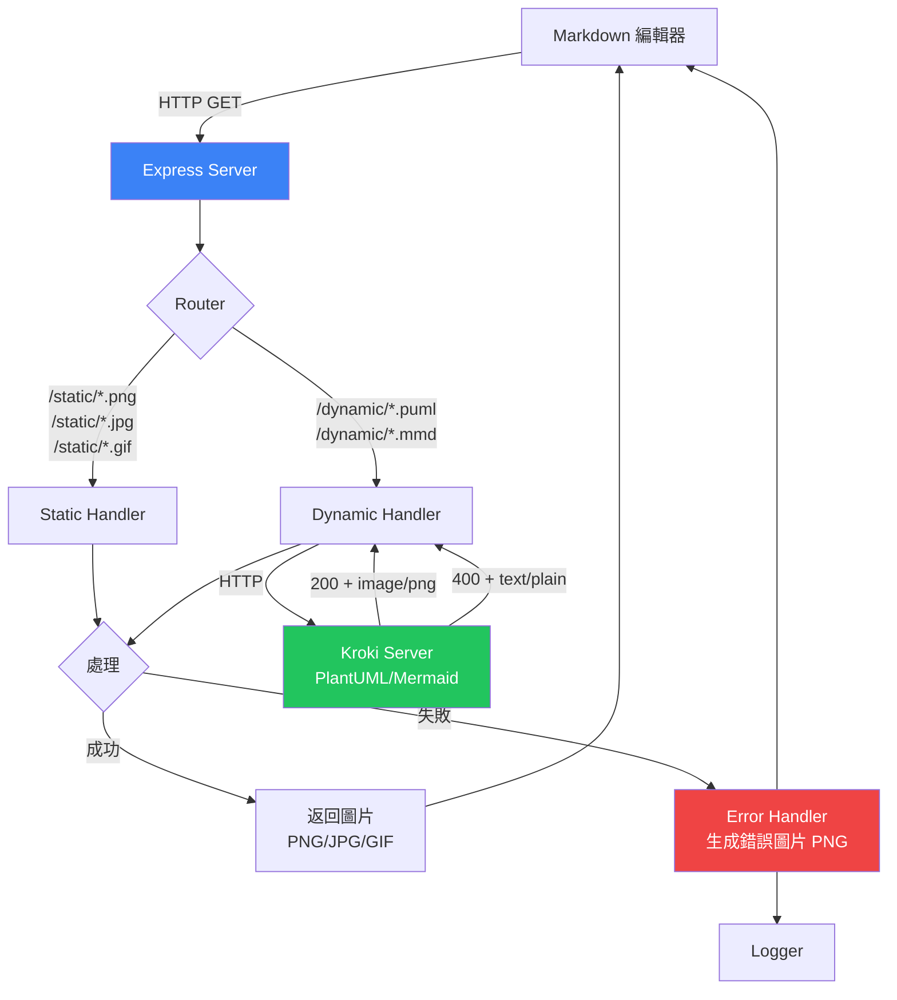
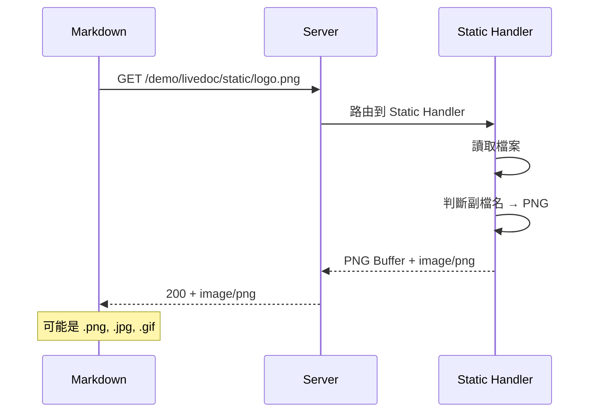
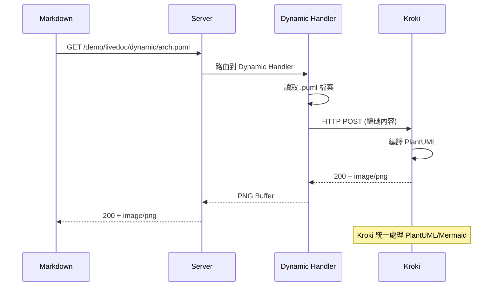
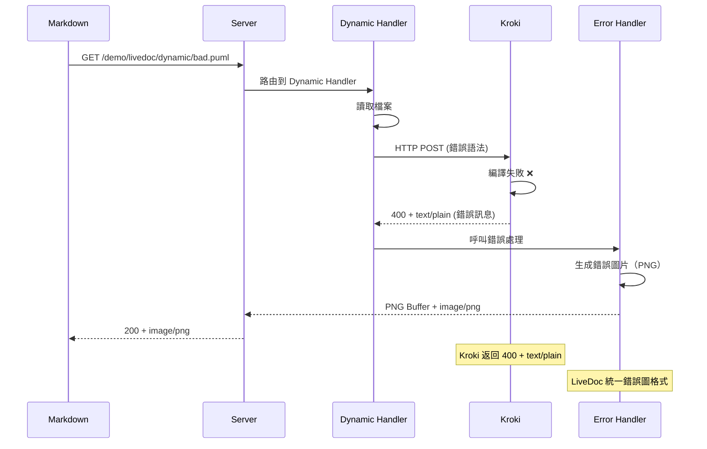

# 📋 LiveDoc MVP 驗證版（簡化錯誤處理）

## 🎯 核心目標

**驗證：Markdown 可以透過 HTTP Server 顯示即時生成的圖片**

## 🔑 核心原則

### **不管什麼情況都要返回圖片！**

```
任何請求 → 一定返回圖片
├─ 成功 → 返回對應格式的圖片（PNG/GIF/JPG）
└─ 失敗 → 返回錯誤圖片（PNG）
```

**為什麼？**
- Markdown 編輯器只認得「HTTP 200 + image/*」
- 如果返回錯誤碼，Markdown 會顯示破圖 🖼️❌
- 錯誤資訊也要視覺化

---

## 🚀 快速開始（Demo）

### 前置準備
```bash
# 1. 安裝依賴
npm install

# 2. 啟動 Kroki 服務（必須）
docker-compose up -d
```

### 啟動 Demo
```bash
# 3. 啟動 LiveDoc 服務器
node bin/livedoc.js start

# 輸出：
# ✅ LiveDoc server running on http://localhost:3000
# 📁 Registered projects: 1
# 🔧 Kroki service: http://localhost:8000
```

### 測試 Demo
```bash
# 方法 1：瀏覽器直接測試
open http://localhost:3000/demo/livedoc/static/test.png
open http://localhost:3000/demo/livedoc/dynamic/demo.puml
open http://localhost:3000/demo/livedoc/dynamic/flow.mmd

# 方法 2：用 Markdown 預覽
# 用 VS Code 打開 demo/README.md
# 按 Cmd+Shift+V (Mac) 或 Ctrl+Shift+V (Windows)
# 注意：使用內建預覽，不要用"增強預覽"插件
```

### Demo 目錄結構
```
demo/
├── README.md              # 包含測試用的圖片連結
└── livedoc/
    ├── static/
    │   ├── test.png      # 靜態圖片測試
    │   ├── test.jpg
    │   └── test.gif
    └── dynamic/
        ├── demo.puml     # PlantUML 測試
        ├── flow.mmd      # Mermaid 測試
        └── error.puml    # 錯誤處理測試
```

---

## 💡 為什麼要做 LiveDoc？

### 問題
```markdown
  ← 過時
  ← 手動更新
```

- 🔴 圖表容易過時
- 🔴 維護成本高

### 解決方案
```markdown


```

- ✅ 永遠最新
- ✅ 零維護
- ✅ 支援多種格式

---

## 🏗️ 系統架構



---

## 📊 支援的檔案格式

### Static Handler（直接返回）

| 檔案類型 | 副檔名 | Content-Type | 說明 |
|---------|--------|--------------|------|
| PNG | `.png` | `image/png` | 靜態圖片 |
| JPG | `.jpg`, `.jpeg` | `image/jpeg` | 靜態圖片 |
| GIF | `.gif` | `image/gif` | 靜態圖片（含動畫） |
| SVG | `.svg` | `image/svg+xml` | 向量圖（可選支援） |

### Dynamic Handler（透過 Kroki 編譯）

| 檔案類型 | 副檔名 | 輸出格式 | Content-Type |
|---------|--------|---------|--------------|
| PlantUML | `.puml` | PNG | `image/png` |
| Mermaid | `.mmd` | PNG | `image/png` |

**使用 Kroki 統一處理 PlantUML 和 Mermaid**

### Error Handler（錯誤時返回）

| 情況 | 輸出格式 | Content-Type |
|-----|---------|--------------|
| 任何錯誤 | PNG | `image/png` |

---

## 🔄 資料流

### 成功流程（Static）


### 成功流程（Dynamic）


### 錯誤流程（Dynamic - 語法錯誤）


---

## 🌐 URL 範例

### Static（返回原始格式）
```markdown


```

**返回格式**：
- `logo.png` → `image/png`
- `photo.jpg` → `image/jpeg`
- `loading.gif` → `image/gif`

### Dynamic（返回 PNG）
```markdown


```

**返回格式**：
- `arch.puml` → 編譯成 PNG → `image/png`
- `flow.mmd` → 編譯成 PNG → `image/png`

---

## ❌ 錯誤處理

### 錯誤檢測機制

**使用 Kroki 進行語法驗證**：
- Kroki 語法正確: `200` + `image/png`
- Kroki 語法錯誤: `400` + `text/plain` + 錯誤訊息

**關鍵**：透過 HTTP status code 和 Content-Type 判斷！

### 錯誤類型

| 錯誤類型 | 說明 | 檢測方式 | 處理方式 |
|---------|------|---------|---------|
| **檔案不存在** | 找不到對應檔案 | 檔案系統 | 錯誤圖片（PNG）+ 提示路徑 |
| **編譯失敗** | .puml/.mmd 語法錯誤 | Kroki 400 + text/plain | 錯誤圖片（PNG）+ 錯誤訊息 |
| **專案未註冊** | URL 的 project 不存在 | Config 檢查 | 錯誤圖片（PNG）+ 提示 init |
| **不支援格式** | 非 PNG/JPG/GIF/PUML/MMD | 副檔名檢查 | 錯誤圖片（PNG）+ 支援格式列表 |
| **其他錯誤** | 任何未預期的錯誤 | Exception | 通用錯誤圖片（PNG） |

### 錯誤圖片格式

**固定格式**：PNG
**尺寸**：600x400
**背景色**：淺紅色

```
┌─────────────────────────────────────┐
│ ❌ LiveDoc Error                    │
├─────────────────────────────────────┤
│ Type: [錯誤類型]                     │
│ File: [檔案路徑]                     │
│ Line: [行數] (如果有)                │
│                                     │
│ Error:                              │
│ [錯誤訊息]                           │
│                                     │
│ 📝 Check: ~/.livedoc/logs/          │
│                                     │
│ [時間戳記]                           │
└─────────────────────────────────────┘
```

---

## 📂 專案結構

```
livedoc/
├── bin/
│   └── livedoc.js
├── src/
│   ├── cli/
│   │   ├── init.js
│   │   ├── start.js
│   │   └── list.js
│   ├── server/
│   │   ├── app.js              # Server 啟動
│   │   ├── router.js           # 路由解析
│   │   └── handlers/
│   │       ├── static.js       # 靜態檔案（PNG/JPG/GIF）
│   │       └── dynamic.js      # PlantUML/Mermaid (透過 Kroki)
│   └── utils/
│       ├── config.js           # 設定管理
│       ├── logger.js           # 日誌記錄
│       ├── error-handler.js    # 錯誤處理（生成 PNG）
│       ├── kroki.js            # Kroki API 封裝
│       └── mime-types.js       # Content-Type 判斷
└── package.json
```

---

## 🔧 Content-Type 判斷邏輯

### Static Handler
```javascript
// 根據副檔名返回對應的 Content-Type
const getContentType = (filename) => {
  if (filename.endsWith('.png')) return 'image/png';
  if (filename.endsWith('.jpg') || filename.endsWith('.jpeg')) return 'image/jpeg';
  if (filename.endsWith('.gif')) return 'image/gif';
  if (filename.endsWith('.svg')) return 'image/svg+xml';
  return 'image/png'; // 預設
};
```

### Dynamic Handler
```javascript
// 透過 Kroki 生成圖片
const krokiRes = await fetch(`http://localhost:8000/${type}/png/${encoded}`);

if (krokiRes.status === 400 && krokiRes.headers.get('content-type') === 'text/plain') {
  // 語法錯誤！呼叫 Error Handler
  const errorMsg = await krokiRes.text();
  return generateErrorImage(errorMsg);
}

// 成功，返回圖片
const buffer = await krokiRes.buffer();
res.type('png').send(buffer);
```

### Error Handler
```javascript
// 錯誤圖片固定返回 PNG
res.type('png').send(errorImageBuffer);
```

---

## 📋 全域設定

### 設定檔位置
```
~/.livedoc/
├── config.json
└── logs/
    └── 2024-10-01.log
```

### config.json
```json
{
  "projects": {
    "demo": "/path/to/demo",
    "test": "/path/to/test"
  },
  "port": 3000,
  "supportedFormats": {
    "static": [".png", ".jpg", ".jpeg", ".gif"],
    "dynamic": [".puml", ".mmd"]
  }
}
```

---

## 📝 日誌格式

```
[2024-10-01 14:23:45] INFO  | static/logo.png    | Served as image/png
[2024-10-01 14:23:46] INFO  | static/photo.jpg   | Served as image/jpeg
[2024-10-01 14:23:47] INFO  | static/load.gif    | Served as image/gif
[2024-10-01 14:23:48] INFO  | dynamic/arch.puml  | Compiled to PNG
[2024-10-01 14:23:49] ERROR | dynamic/bad.puml   | Compile Error → Error PNG
[2024-10-01 14:23:50] ERROR | static/xxx.png     | File not found → Error PNG
```

---

## ✅ 驗收標準

### 測試步驟
```bash
cd test_project
livedoc init
livedoc start
```

### 測試項目

#### 1. Static 格式測試
```markdown


```
- ✅ PNG 正確顯示（Content-Type: image/png）
- ✅ JPG 正確顯示（Content-Type: image/jpeg）
- ✅ GIF 正確顯示（Content-Type: image/gif）
- ✅ 日誌記錄格式

#### 2. Dynamic 格式測試
```markdown


```
- ✅ .puml 編譯成 PNG（Content-Type: image/png）
- ✅ .mmd 編譯成 PNG（Content-Type: image/png）
- ✅ 日誌記錄編譯成功

#### 3. 錯誤情況測試

**檔案不存在**
```markdown

```
- ✅ 顯示錯誤圖片（PNG 格式）
- ✅ 日誌記錄 ERROR

**編譯錯誤**
```markdown

```
- ✅ 顯示錯誤圖片（PNG 格式 + 錯誤訊息）
- ✅ 日誌記錄 ERROR

**不支援格式**
```markdown

```
- ✅ 顯示錯誤圖片（PNG 格式 + 不支援提示）
- ✅ 日誌記錄 ERROR

---

## 📦 依賴

### Node.js 依賴
```json
{
  "dependencies": {
    "express": "^4.18.0",
    "commander": "^11.0.0",
    "canvas": "^2.11.0",
    "mime-types": "^2.1.35"
  }
}
```

### 外部服務（Docker）
**Kroki** - 統一處理 PlantUML + Mermaid
```yaml
# docker-compose.yml
version: "3"
services:
  kroki:
    image: yuzutech/kroki
    ports:
      - "8000:8000"
    environment:
      - KROKI_MERMAID_HOST=mermaid
  mermaid:
    image: yuzutech/kroki-mermaid
```

**優點**：
- ✅ 不需要本地安裝 Java/Puppeteer
- ✅ 統一錯誤處理（400 + text/plain）
- ✅ 支援 20+ 圖表格式

---

## 🎯 重點總結

### 格式規則
```
Static Handler
├─ .png → image/png
├─ .jpg/.jpeg → image/jpeg
└─ .gif → image/gif

Dynamic Handler
├─ .puml → 編譯 → image/png
└─ .mmd → 編譯 → image/png

Error Handler
└─ 任何錯誤 → 錯誤圖片 → image/png
```

### 核心原則
1. **Static 保持原格式**：PNG 就返回 PNG，GIF 就返回 GIF
2. **Dynamic 固定 PNG**：編譯結果統一為 PNG
3. **Error 固定 PNG**：錯誤圖片統一為 PNG
4. **永遠返回圖片**：即使錯誤也返回 HTTP 200 + 錯誤圖片

---

這樣清楚了！主要就是：
- **Static** → 什麼格式進來就什麼格式出去
- **Dynamic** → .puml/.mmd 編譯成 PNG
- **Error** → 統一返回 PNG 錯誤圖片