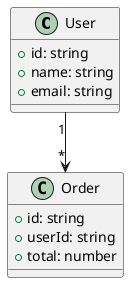

# LiveDoc v2 Quickstart Guide

## Installation

```bash
npm install -g @livedoc/cli
```

## Basic Usage

### 1. Start the server

在任何專案目錄下執行：

```bash
livedoc start
```

輸出：
```
LiveDoc v2.0.0 started on http://localhost:3000
Serving files from: /path/to/your/project
Kroki service: https://kroki.io
```

### 2. Add a diagram

建立一個 PlantUML 檔案 `diagrams/class.puml`：



### 3. Use in Markdown

在你的 `README.md` 或其他 Markdown 文件中：

```markdown
## Architecture


```

### 4. Preview

在支援圖片預覽的 Markdown 編輯器（如 VS Code、Typora）中開啟文件，即可看到即時渲染的圖表。

## SpecKit Integration

### Directory Structure

```
your-project/
├── specs/
│   └── 001-feature/
│       ├── spec.md
│       ├── plan.md
│       └── diagrams/
│           ├── architecture.puml
│           └── flow.mmd
└── src/
    └── ...
```

### In spec.md

```markdown
## Architecture


## User Flow


```

## Configuration

### Environment Variables

```bash
# Custom port
LIVEDOC_PORT=8080 livedoc start

# Custom Kroki service
LIVEDOC_KROKI_URL=https://kroki.chuntech.org livedoc start
```

### Configuration File

建立 `.livedocrc` 在專案根目錄：

```json
{
  "port": 8080,
  "krokiUrl": "https://kroki.chuntech.org"
}
```

## Supported Formats

### Dynamic (rendered via Kroki)

| Extension | Type | Description |
|-----------|------|-------------|
| `.puml` | PlantUML | UML diagrams |
| `.mmd` | Mermaid | Flowcharts, sequence diagrams |
| `.d2` | D2 | Modern diagram language |
| `.nomnoml` | Nomnoml | Class diagrams |
| `.erd` | ERD | Entity-Relationship |
| `.bpmn` | BPMN | Business process |
| ... | ... | 25+ more formats |

### Static (passthrough)

| Extension | Type |
|-----------|------|
| `.png` | PNG images |
| `.jpg` | JPEG images |
| `.gif` | GIF images |
| `.svg` | SVG images |

## CLI Commands

```bash
# Start server (default port 3000)
livedoc start

# Start on specific port
livedoc start --port 8080

# Show version
livedoc --version

# Show help
livedoc --help
```

## Error Handling

所有錯誤都會返回一張包含錯誤訊息的圖片，確保 Markdown 預覽不會顯示破圖。

### Error Types

- **File Not Found**: 檔案不存在
- **Unsupported Format**: 不支援的檔案格式
- **Kroki Error**: Kroki 服務連線錯誤
- **Syntax Error**: 圖表語法錯誤
- **File Too Large**: 檔案超過 1MB 限制

## Troubleshooting

### Port already in use

LiveDoc 會自動尋找下一個可用的 port：

```
Port 3000 is in use, trying 3001...
LiveDoc started on http://localhost:3001
```

### Kroki service unavailable

確認網路連線，或設定自建的 Kroki 服務：

```bash
LIVEDOC_KROKI_URL=http://localhost:8000 livedoc start
```

### Diagram not updating

重新載入 Markdown 預覽，或清除瀏覽器快取。LiveDoc 不會快取圖片，每次請求都會重新渲染。
